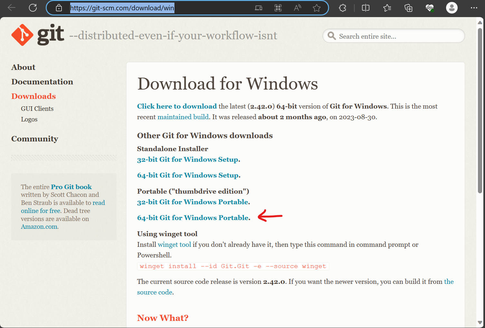
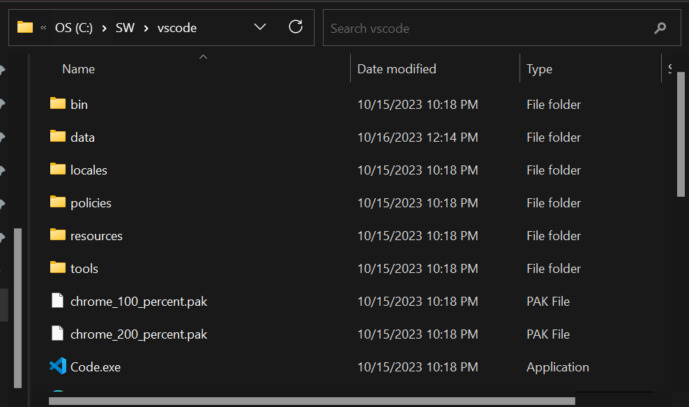

# Windows Development Environment

This will define the setup process, softwares needed, and other things that are needed to prepare our windows PC for development.

# Contents
- [The SW Folder](#the-sw-folder)
- [The projects Folder](#the-projects-folder)
- [7zip Installation](#7zip-installation)
- [GIT Installation](#git-installation)
- [VSCode Installation](#visual-studio-code-installation)

## The `SW` Folder

This is where we will install all of our needed software.

Create a `SW` folder in the root `C:\` drive.

## The `projects` Folder

This is where all of our projects live.

Create a `projects` folder in the root `C:\` drive.

## 7zip Installation

7zip is a free and open source file archiver. 7zip can compress and decompress files and folders.

Direct Link: [7zip Download](https://7-zip.org/)

Open up the link above and download the latest x64 exe file.

Once the file is downloaded, open it up and set its install path to `C:\SW\7zip`.

## GIT Installation

Git is a free and open source version control system that tracks changes to our source codes.

Direct Link: [Git Download](https://git-scm.com/download/win)

Open up the link above and select `64-bit Git for Windows Portable`.

Once the file is downloaded, open it up and set its install path to `C:\SW\git\`

## Visual Studio Code Installation

Visual Studio Code (vscode) is an editor created by Microsoft for building and debugging modern web and cloud applications.

Direct Link: [VSCode Download](https://code.visualstudio.com/#alt-downloads)

Open up the link above and select the latest 64-bit zip file.

Once downloaded, open up the zip file and copy/extract its contents to `C:\SW\vscode\` folder.

## MSYS2 Installation

MSYS2 is a collection of tools and libraries providing you with an easy-to-use environment for building, installing and running native Windows software.

Direct Link: [MSYS2 GitHub Download](https://github.com/msys2/msys2-installer/releases/latest)

Open up the link above and click on the latest .tar.xz file from the list.

Once downloaded, open up the .tar.xz file using 7zip via context menus in windows. Then copy/extract contents to `C:\SW\msys\` folder.

## NodeJS Installation

NodeJS is a free and open source server for Javascript runtime environment running on the V8 engine.

Direct Link: [NodeJS Download](https://nodejs.org/en/download)

Open up the link above and click on the latest LTS 64-bit .zip file

Once downloaded, open up the zip file and copy/extract the contents to `C:\SW\nodejs\` folder.

